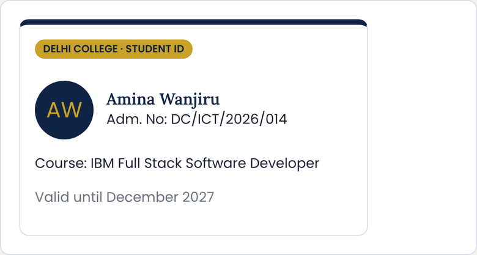
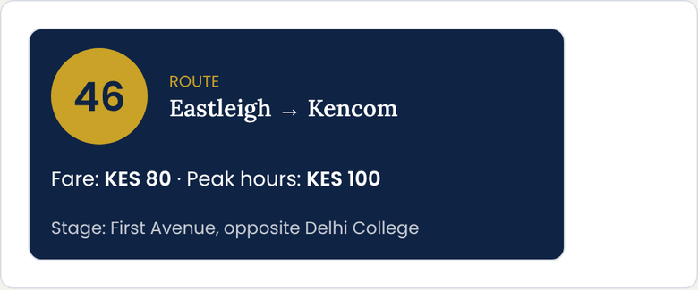

# Topic 01 · JSX and Components

Build your first React components and learn the rules of JSX.

**Level:** Beginner · **Folder:** `src/topics/01-jsx-components/`

| File | Task | What it covers | What it does |
| --- | --- | --- | --- |
| [Task1.jsx](Task1.jsx) | Hello, Delhi College | Returning JSX, one parent element | Welcomes students to the course with a heading and two lines |
| [Task2.jsx](Task2.jsx) | Student ID Card | Variables in `{ }`, string methods | Shows a student ID card with initials worked out from the name |
| [Task3.jsx](Task3.jsx) | Price Calculator | Calculations in JSX, `toLocaleString` | Bills three laptop bags with 16% VAT in KES |
| [Task4.jsx](Task4.jsx) | Matatu Route Board | `className` and style objects | Displays a navy and gold board for matatu route 46 |
| [Task5.jsx](Task5.jsx) | Page Layout | Several components in one file | Builds a college page from Header, Main and Footer |
| [Task6.jsx](Task6.jsx) | Campus Parts | Default and named exports | Imports a logo, address and contact card from another file |
| [Task7.jsx](Task7.jsx) | Weekly Timetable | Fragments, tables, JSX comments | Shows a week of ICT Diploma lessons in a table |
| [Task8.jsx](Task8.jsx) | Staff Profile Page | Composing a page | Puts together a staff profile from small components |

Task 6 also uses **CampusParts.jsx**, which holds the three components it imports.

## Screenshots

**Task 2 · Student ID Card**

**Task 4 · Matatu Route Board**

## How to open the tasks

1. In the project folder, run `npm install` (only the first time), then `npm run dev`.
2. Open the address Vite prints, usually http://localhost:5173.
3. On the home page, find **01 · JSX and Components** and click a task.

You can also go straight to a task by its address, for example `http://localhost:5173/#/01-jsx-components/3` opens Task 3. Save a file and the page updates by itself.

---

[← Back to the course home](../../../README.md)
